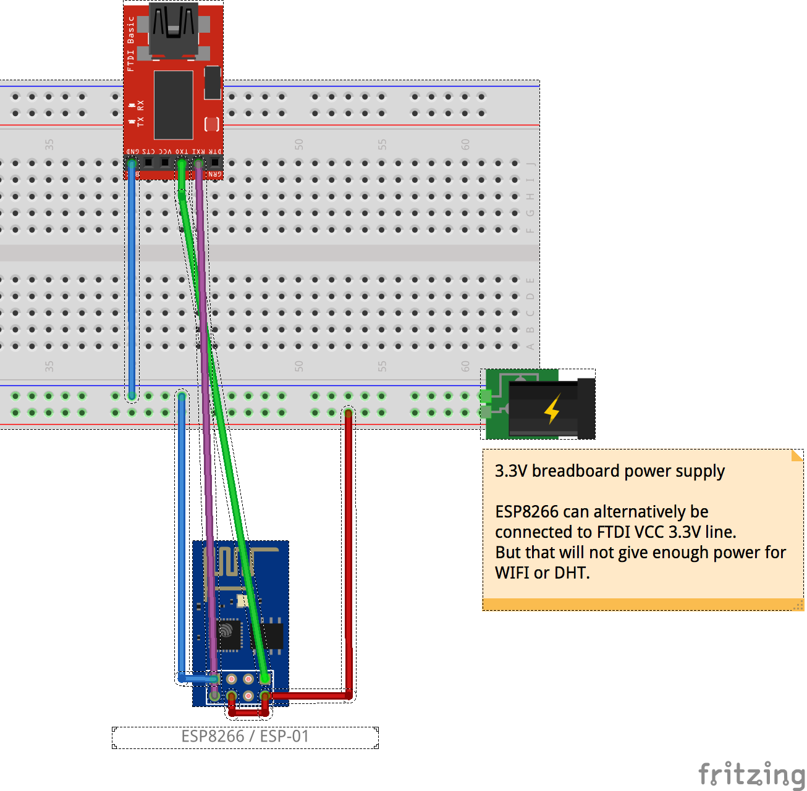

DHT11 Temperature- & Humidity-Sensor for ESP8266
================================================

Read temperature & humidity from DHT11 sensor,
prints values to serial console and sends values to thingspeak.

Note (!)
--------
For measuring humidity the accuracy of DHT22 is much better, I suggest you switch to a DHT22.

[Temperature & Humidity sensors comparison](http://playground.boxtec.ch/doku.php/sensors/temp-hum_sensors_compared#luftfeuchte)

Usage
-----
1. install nodemcu firmware on esp
1. copy init.lua.example -> init.lua
1. configure WLAN & SSID in init.lua
1. cp senddata.lua.example -> senddata.lua
1. configure thingspeak api key(s) in senddata.lua
1. upload all files to ESP (see install_dht.sh)

Disclaimer
----------
Parts of the source code are taken from here:
[http://www.esp8266.com/viewtopic.php?f=19&t=1363&start=0](http://www.esp8266.com/viewtopic.php?f=19&t=1363&start=0)

Hardware Setup
--------------

Screenshots
-----------

Thingspeak Charts for DHT11 sensor: 

Highstock Charts for DHT11 sensor: 
