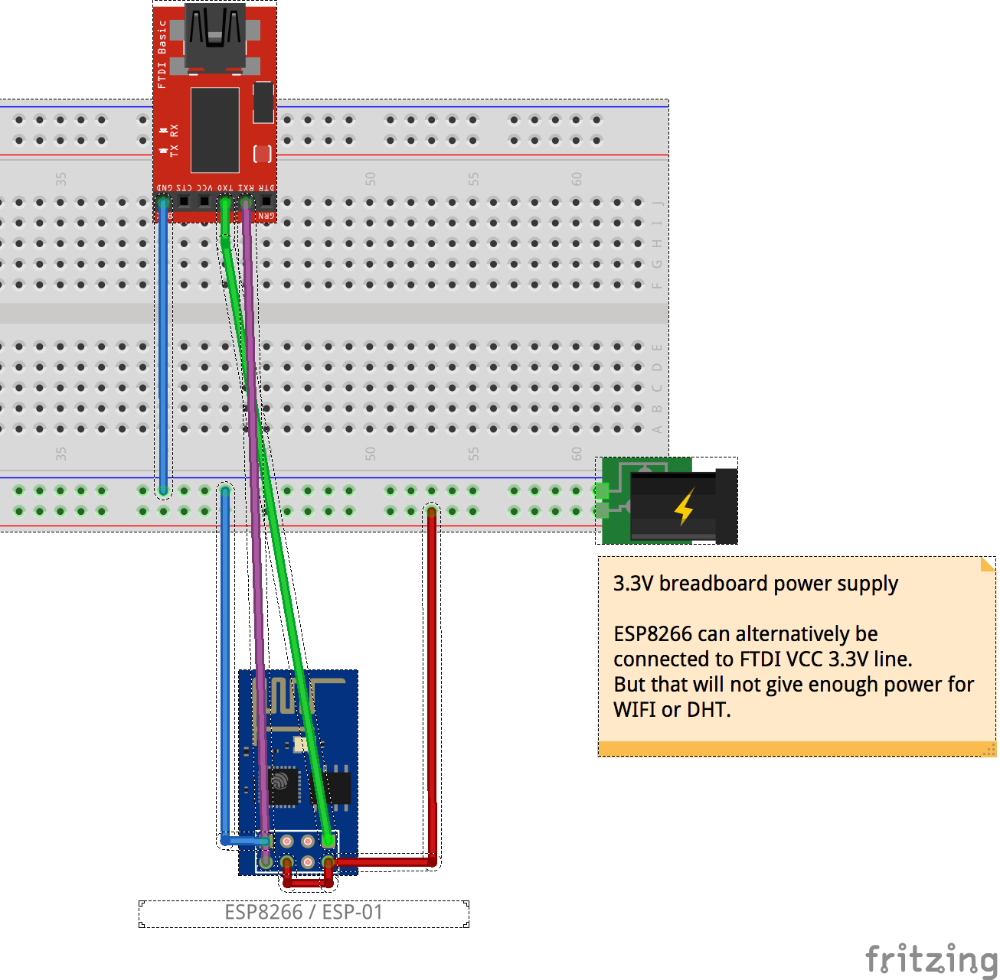
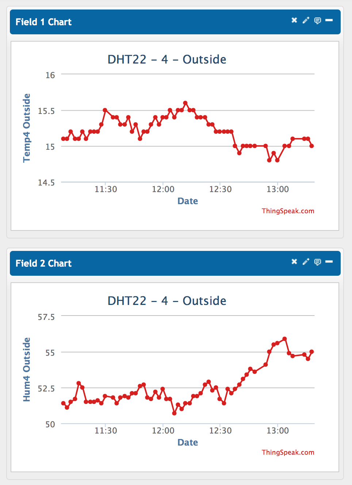
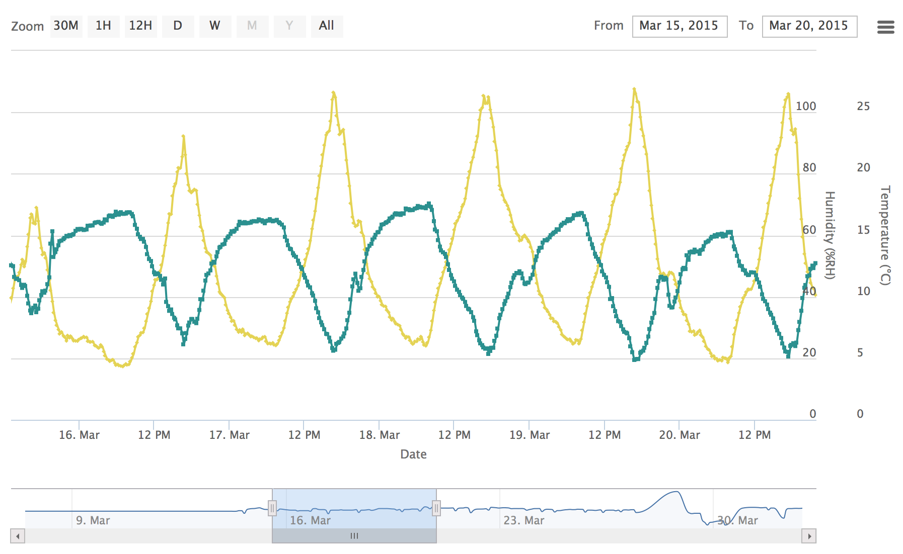
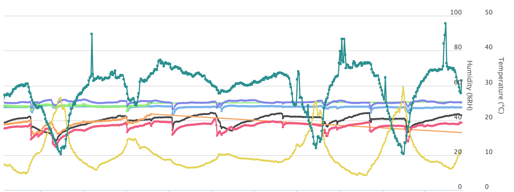

DHT22 Temperature- & Humidity-Sensor for ESP8266
================================================

Read temperature & humidity from DHT22 sensor,
prints values to serial console and sends values to thingspeak.

Usage
-----
1. copy init.lua.example -> init.lua
1. configure WLAN & SSID in init.lua
1. cp senddata.lua.example -> senddata.lua
1. configure thingspeak api key(s) in senddata.lua
1. upload all files to ESP (see install_dht.sh)

Hardware Setup
--------------

Disclaimer
----------
Parts of the source code are taken from here:

* [http://www.esp8266.com/viewtopic.php?f=19&t=1363&start=0](http://www.esp8266.com/viewtopic.php?f=19&t=1363&start=0)
* [http://www.esp8266.com/viewtopic.php?f=19&t=1508](http://www.esp8266.com/viewtopic.php?f=19&t=1508)

Screenshots
-----------

Thingspeak charts for DHT22 sensor: 

Highstock charts for DHT22 sensor: 

Highstock charts for multiple DHT22 sensor: 

